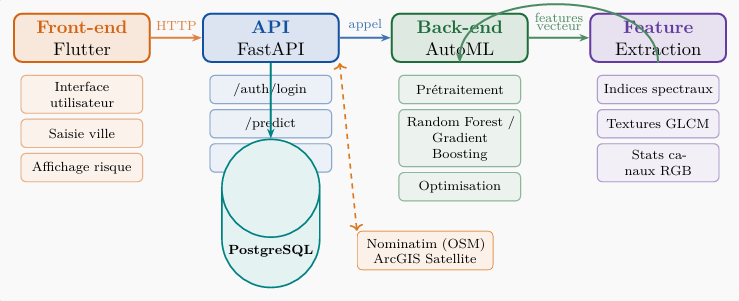
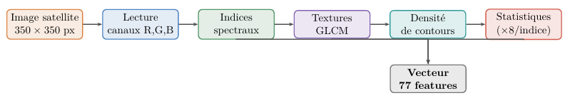
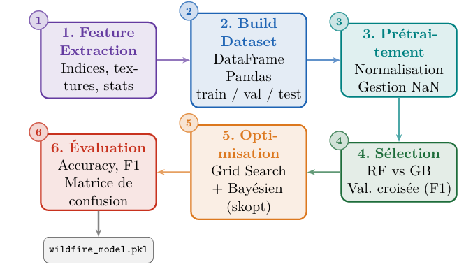

<div align="center">


<br/><br/>

# WildFire Alert

### Prédiction de risque d'incendie par imagerie satellite: système ML complet avec application Flutter, backend FastAPI et pipeline AutoML

<br/>

> L'utilisateur saisit le nom d'une ville. En quelques secondes, le système retourne une probabilité d'incendie et un niveau d'alerte visuel.  
> Le modèle se trompe sur moins de 6 cas sur 1 000.

</div>

---

## Table des matières

- [Vue d'ensemble](#vue-densemble)
- [Architecture globale](#architecture-globale)
- [Structure du projet](#structure-du-projet)
- [Pipeline d'extraction de features](#pipeline-dextraction-de-features)
- [Pipeline AutoML](#pipeline-automl)
- [Contrat d'API REST](#contrat-dapi-rest)
- [Application mobile Flutter](#application-mobile-flutter)
- [DevOps & CI/CD](#devops--cicd)
- [Résultats](#résultats)
- [Lancer le projet](#lancer-le-projet)
- [Perspectives](#perspectives)

---

## Vue d'ensemble

WildFire Alert est un système d'IA complet qui prédit le risque d'incendie de forêt à partir d'imagerie satellite. L'utilisateur entre un nom de ville dans l'application mobile, le système géocode la localisation, télécharge une tuile satellite réelle, extrait 77 features ingéniérées, et les passe à un classifieur GradientBoosting pour retourner une probabilité de risque avec un niveau d'alerte coloré.

Le projet intègre un pipeline DevOps complet : trois services Dockerisés, une stratégie GitFlow, et un pipeline GitHub Actions qui exécute les tests unitaires et construit les images Docker à chaque pull request.

**Jeu de données :** [Wildfire Prediction Dataset](https://www.kaggle.com/datasets/abdelghaniaaba/wildfire-prediction-dataset) 42 850 images satellite (350×350px), deux classes (Wildfire / No Wildfire), issues de coordonnées GPS de feux répertoriés au Canada via l'API MapBox. Licence : CC-BY 4.0.

---

## Architecture globale

Le système est composé de quatre couches qui communiquent séquentiellement du frontend mobile vers le backend ML.

<div align="center">
  
</div>

> Tous les services partagent un réseau Docker privé. Les artefacts du modèle sont partagés via un volume Docker monté.
---

## Structure du projet

```
wildfire-alert/
│
├── frontend/                        # Application mobile Flutter
│   ├── lib/
│   │   ├── constants/               # URLs et routes de l'API (baseUrl, /auth, /predict, /admin/*)
│   │   ├── screens/                 # Splash, Login, Register, User, Admin
│   │   ├── services/                # Communication
│   │   ├── widgets/                 # Composants réutilisables
│   │   └── main.dart
│   └── pubspec.yaml
│
├── backend/
│   │
│   ├── app/                         # Application FastAPI
│   │   ├── controllers/
│   │   │   ├── auth.py              # Inscription / connexion
│   │   │   ├── predict.py           # Endpoint de prédiction
│   │   │   └── admin.py             # Gestion modèle & entraînement
│   │   ├── crud.py                  # Opérations base de données
│   │   ├── database.py              # Connexion SQLAlchemy
│   │   ├── dependencies.py          # Injection de dépendances (auth)
│   │   ├── models.py                # Modèles ORM
│   │   ├── schemas.py               # Schémas Pydantic
│   │   ├── security.py              # JWT, hachage bcrypt
│   │   ├── predictor.py             # Bridge vers le service AutoML
│   │   ├── init_db.py               # Initialisation du schéma
│   │   ├── init_admin.py            # Création du compte admin par défaut
│   │   ├── main.py                  # Point d'entrée (uvicorn)
│   │   ├── Dockerfile
│   │   └── requirements.txt
│   │
│   └── automl/                      # Service pipeline AutoML
│       ├── trainer/
│       │   ├── model_trainer.py     # Orchestration entraînement
│       │   ├── gboost_classification.py
│       │   ├── gboost_regression.py
│       │   ├── rf_classification.py
│       │   ├── rf_regression.py
│       │   └── model.py             # Interface commune des modèles
│       ├── automl.py                # Pipeline principal AutoML
│       ├── feature_extraction.py    # Indices spectraux, GLCM, Canny
│       ├── select_model.py          # Sélection & optimisation du modèle
│       ├── data_preparation.py      # Prétraitement, normalisation
│       ├── data_info.py             # Détection type de problème
│       ├── tuple.py                 # Structures de données internes
│       ├── app.py                   # Service Flask sur le port 5050
│       ├── Dockerfile
│       └── requirements.txt
│
├── tests/
│   ├── unit/                        # Tests unitaires pytest
│   └── integration/                 # Tests API end-to-end
│
├── docker-compose.yml
├── .github/
│   └── workflows/
│       └── ci.yml                   # Pipeline CI GitHub Actions
└── README.md
```
## Pipeline d'extraction de features

Les images satellite brutes (RGB, 350×350px) sont transformées en vecteur numérique de 77 dimensions avant d'être envoyées au classifieur. Trois familles de descripteurs sont extraites.

<div align="center">
  
</div>

Cet ingénierie de features artisanale est ce qui permet à un modèle classique d'atteindre une précision quasi-parfaite sur une tâche habituellement associée au deep learning.

---

## Pipeline AutoML

Le service AutoML prend un dataset d'images brutes en entrée et retourne un classifieur sérialisé et optimisé — entièrement automatisé, sans réglage manuel.

<div align="center">
  
</div>

**Stack :** `scikit-learn` · `scikit-optimize` · `opencv-python` · `scikit-image` · `numpy` · `pandas` · `scipy`

---

## Contrat d'API REST

L'API est construite avec **FastAPI**, tourne sur le **port 8000**, et utilise des **tokens JWT Bearer** (expiration 60 min) pour l'authentification. Deux rôles : `user` et `admin`.

### Authentification — `/auth`

| Méthode | Endpoint | Corps | Réponse |
|---------|----------|-------|---------|
| `POST` | `/auth/register` | `username`, `email`, `password` | `UserResponse` |
| `POST` | `/auth/login` | `username`, `password` (OAuth2) | `{ access_token, token_type }` |

Mots de passe hachés avec **bcrypt** via `passlib`. Unicité enforced sur username et email.

---

### Prédiction — `/predict`

| Méthode | Endpoint | Paramètre | Réponse |
|---------|----------|-----------|---------|
| `POST` | `/predict/` | `city: str` | probabilité + niveau de risque |

**Déroulement en 4 étapes :**

```
1. nom de ville  →  Nominatim (OSM)          →  coordonnées GPS
2. coordonnées   →  ArcGIS World Imagery     →  tuile satellite (zoom 15)
3. tuile         →  feature_extraction.py    →  vecteur 77 dimensions
4. vecteur       →  modèle                   →  probabilité d'incendie
```

**Seuils de risque (empiriques) :**

| Probabilité | Niveau | Couleur |
|-------------|--------|---------|
| 0.00 – 0.30 | FAIBLE | 🟢 Vert |
| 0.30 – 0.55 | MODÉRÉ | 🟠 Orange |
| 0.55 – 0.75 | ÉLEVÉ | 🔴 Rouge |
| 0.75 – 1.00 | CRITIQUE | 🔴 Rouge vif |

**Exemple de réponse :**
```json
{
  "city": "Marseille",
  "latitude": 43.2965,
  "longitude": 5.3698,
  "fire_probability": 0.01,
  "risk_level": "LOW"
}
```

---

### Administration — `/admin` *(rôle admin requis)*

| Méthode | Endpoint | Description |
|---------|----------|-------------|
| `POST` | `/admin/train` | Upload d'un dataset → déclenche le pipeline AutoML complet → crée une nouvelle version du modèle |
| `GET` | `/admin/eval` | Retourne le rapport de classification du modèle actif |
| `GET` | `/admin/models/versions` | Liste toutes les versions du modèle avec horodatages |
| `PUT` | `/admin/models/reset` | Désactive le modèle courant (`is_active = false`) |

Chaque entraînement crée une entrée versionnée en base PostgreSQL (type, chemin, date). Traçabilité complète de l'évolution du modèle.

---

## Application mobile Flutter

Cinq écrans, interface dark avec dégradé et accents orange, authentification JWT persistée via `shared_preferences`. Voici l'écran utilisateur:
<div align="center">
  
</div>

> Carte : flutter_map + tuiles OpenStreetMap
> Auth  : token Bearer injecté dans chaque en-tête de requête
> ML    : 100% côté serveur — zéro inférence embarquée sur l'appareil

---

## DevOps & CI/CD

### Docker Compose — 3 services

```yaml
services:
  automl:   port 5050   # Service AutoML (entraînement + inférence)
  api:      port 8000   # FastAPI — dépend de db
  db:       port 5432   # PostgreSQL (réseau interne uniquement)

networks:
  private-network       # services communiquent en interne, db non exposée

volumes:
  model_volume          # wildfire_model.pkl partagé entre automl et api
  postgres_data         # persistance de la base de données
```

Le service API initialise automatiquement le schéma de base de données et crée le compte administrateur par défaut au démarrage.

---

### Stratégie GitFlow

```
main ──────────────────────────────────────────── (production stable)
  └── develop ──────────────────────────────────── (intégration continue)
        ├── feature/automl
        ├── feature/front
        └── feature/api
```

Toutes les fusions vers `develop` passent obligatoirement par une pull request, ce qui déclenche automatiquement le pipeline CI.

---

### Pipeline CI GitHub Actions

Déclenché à chaque **pull request → develop** :

```
┌─────────────────────────────────────────────┐
│  GitHub Actions CI                          │
│                                             │
│  1. Checkout du code                        │
│  2. Setup Python 3.11                       │
│  3. pip install -r requirements.txt         │
│  4. pytest tests/ ── unitaires + intégration│
│  5. docker build  (image automl)            │
│  6. docker build  (image api)               │
└─────────────────────────────────────────────┘
```

Aucun code défaillant n'atteint `develop`.

---

## Résultats

Évaluation sur un **jeu de test équilibré de 850 images** (425 par classe).

### Rapport de classification

| Classe | Précision | Rappel | F1-score | Support |
|--------|-----------|--------|----------|---------|
| No Wildfire | 0.99 | 1.00 | **0.99** | 425 |
| Wildfire | 1.00 | 0.99 | **0.99** | 425 |
| **Global** | | | **0.9941** | **850** |

**Accuracy : 99,41% — F1-macro : 99,41%**

### Matrice de confusion

```
                    Prédit
                  Pas de feu    Feu
Réel  Pas de feu  [   424         1  ]
      Feu         [     4       421  ]
```

Seulement **5 erreurs sur 850 prédictions** :
- 1 faux positif — une zone saine classée à risque
- 4 faux négatifs — des zones à risque non détectées

Le taux de faux négatifs quasi nul est ce qui compte le plus opérationnellement : le système rate rarement un vrai risque d'incendie.

> Le vecteur de 77 features — combinant indices spectraux, textures GLCM et densité de contours — donne au GradientBoosting suffisamment de signal pour égaler, voire dépasser, ce que la plupart des approches CNN atteignent sur ce dataset, à une fraction du coût d'inférence.

---

## Lancer le projet

### Prérequis

- Docker & Docker Compose
- Flutter SDK (pour le mobile)
- Python 3.11+ (pour le développement local)

### Démarrer le backend (3 commandes)

```bash
git clone https://github.com/AliDinarbous//wildfire-alert.git
cd wildfire-alert
docker compose up --build
```

Services disponibles :
- Documentation API interactive : http://localhost:8000/docs
- Service AutoML : http://localhost:5050
- PostgreSQL : localhost:5432

### Lancer l'application Flutter

```bash
cd frontend
flutter run
```

> Sur émulateur Android, l'API est accessible à `10.0.2.2:8000` (redirection loopback).

### Exécuter les tests

```bash
pip install -r backend/requirements.txt
pytest tests/unit/ tests/integration/ -v
```

---

## Perspectives

Le système est fonctionnel de bout en bout, mais plusieurs axes d'amélioration sont identifiés :

- **Intégration RAG** — construire une base vectorielle d'incendies historiques (lieu, date, superficie brûlée, conditions météo) avec Qdrant. À chaque prédiction, le système retrouverait les événements passés les plus similaires et les restituerait à l'utilisateur pour contextualiser la prédiction du modèle. L'architecture est déjà spécifiée.
- **Features météo en temps réel** — intégrer vitesse du vent, humidité et température depuis une API météo ouverte. Le risque d'incendie est fortement dépendant des conditions climatiques ; cela pousserait vraisemblablement les performances encore plus haut.
- **Expérimentations deep learning** — remplacer ou compléter le pipeline de features artisanales par un ResNet ou EfficientNet fine-tuné. L'approche classique actuelle performe déjà remarquablement bien, mais un CNN pourrait capturer des patterns spatiaux que les features manuelles manquent.
- **MLOps & déploiement cloud** — migrer de Docker Compose vers Kubernetes, ajouter un monitoring de dérive du modèle, et automatiser le réentraînement quand les distributions de données évoluent.

---

<div align="center">

**Réalisé à Le Mans Université — M1 Intelligence Artificielle, 2025–2026**  
Module DevOps Mobile — Semestre 2

*Imagerie satellite · Machine Learning · Mobile · DevOps*

</div>
